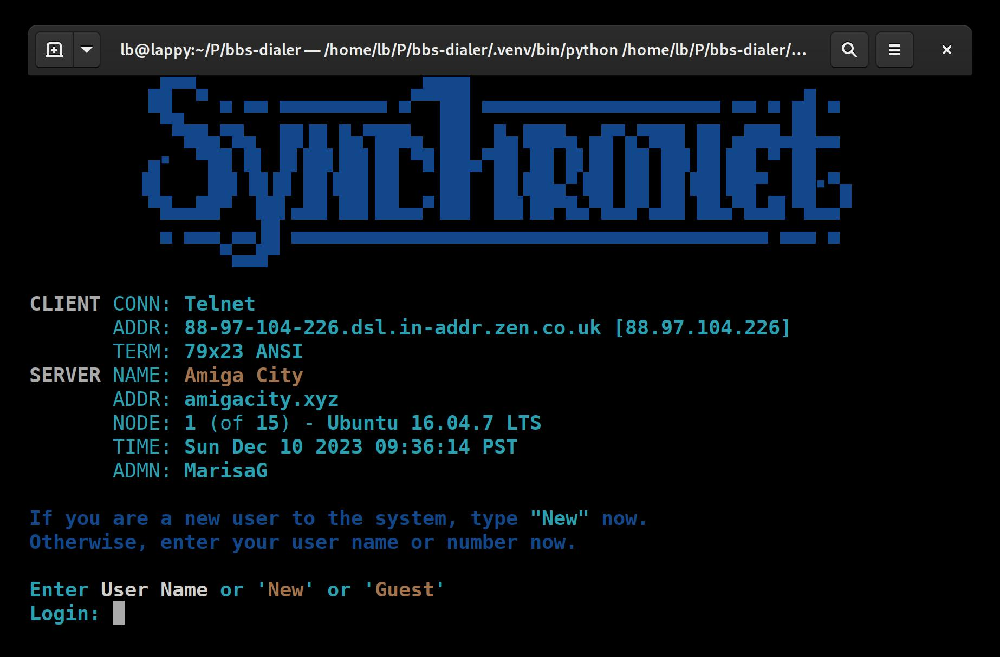
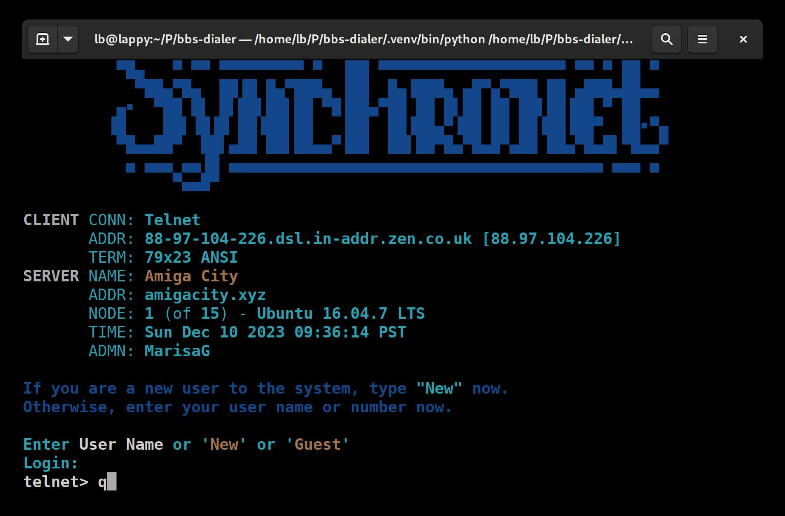
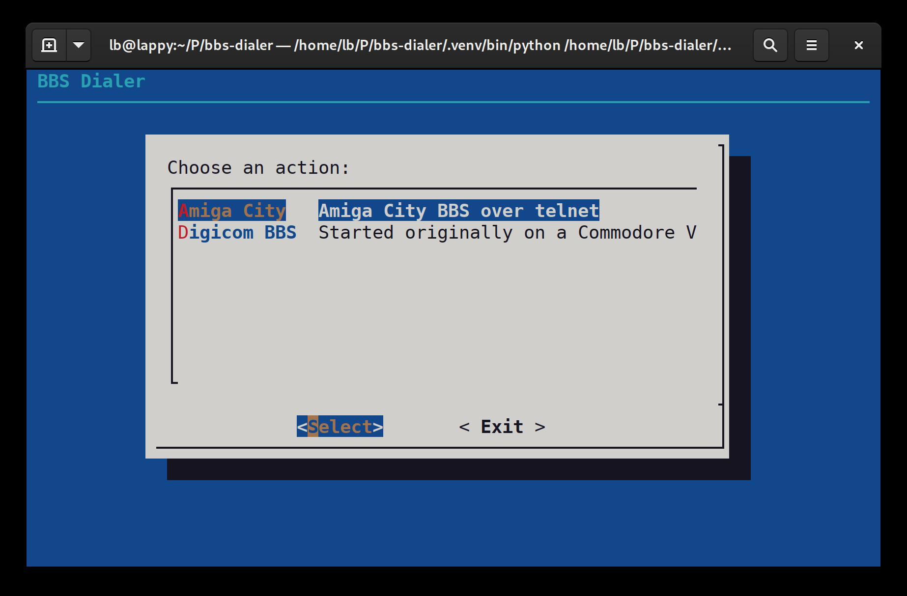
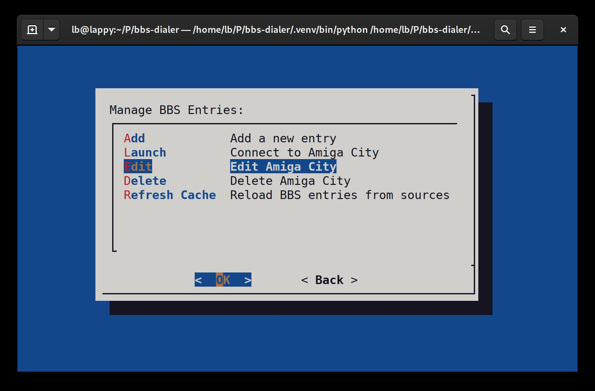
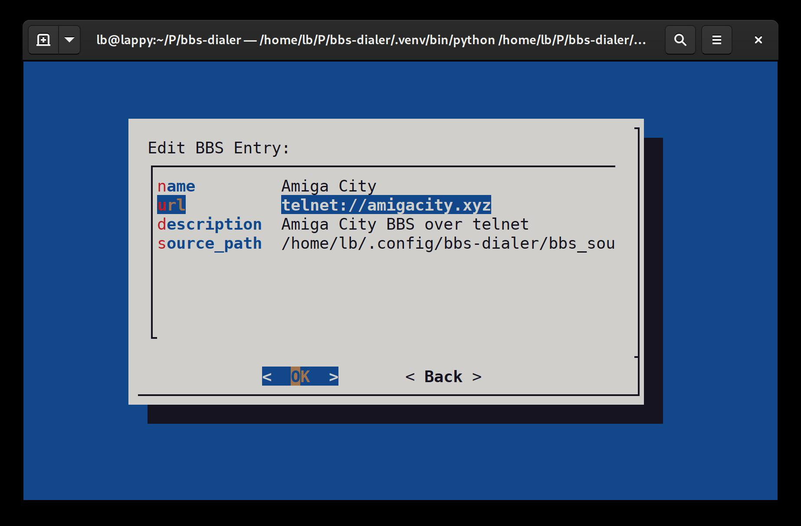
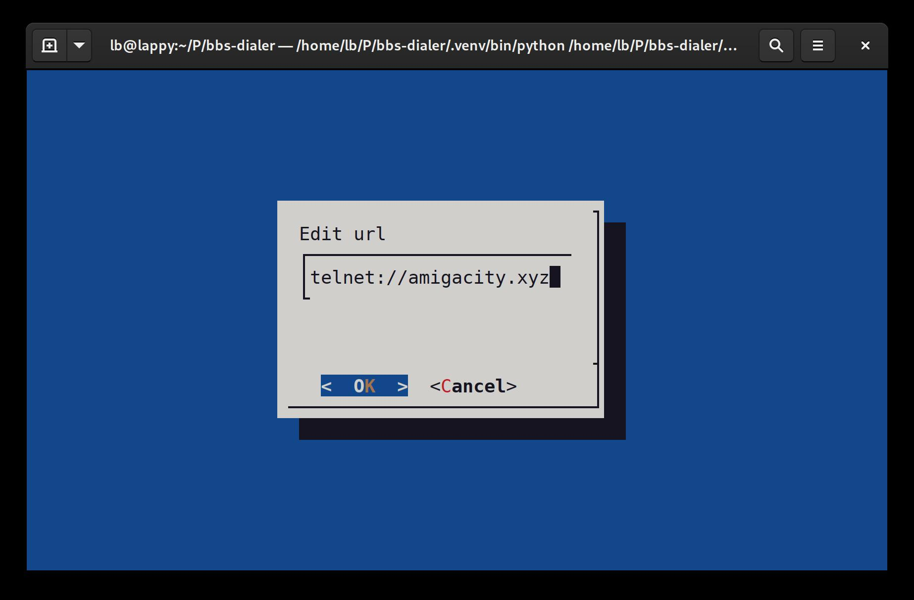

= BBS Dialer

BBS Dialer is a Phonebook / Dialer tool designed for Linux, the BSDs, and other Unix-like operating systems, offering a modern approach to accessing Bulletin Board Systems (BBS's).  It forgoes all of the normal terminal emulator stuff of tools like Minicom, Seyon, etc., and JUST provides the interface to manage BBS listings and "dial" them (over telnet / SSH).

== Overview

BBS Dialer simplifies the process of connecting to and managing BBS entries. It supports various connection protocols like Telnet, SSH, and HTTPS and allows for aggregation of BBS entries from different sources, including local directories and GitHub repositories.

== Screenshots

== Features

* Easy-to-use, interactive menu for managing BBS entries.
* Support for Telnet, SSH, and HTTPS connections.
* Ability to integrate BBS entries from multiple sources.
* Unicode support for better character encoding handling.
* Eliminates the need for serial port emulation and the complexity of using an emulated terminal.

== Compatibility and System Requirements

The tool is designed to work on Unix-like systems such as Linux and BSD. It *might* also be compatible with modern Windows terminal solutions like Windows Terminal, or PuTTY.  You need `python3.9+`, `dialog`, and also `telnet` and `ssh` installed, if you plan to connect to BBS's that use either of those.  `dialog` might be more difficult part to install on Windows.

== Installation

BBS Dialer can be installed either from directly from the source (it builds with Poetry), or using the provided wheel files (*.whl) from the GitHub releases.

=== From GitHub Release

1. Download the latest `.whl` file from the [GitHub Releases](https://github.com/lee-b/bbs-dialer/releases) page.
2. Install the wheel file using pip:
+
[source, bash]
----
pip install /path/to/downloaded/bbs_dialer-*.whl
----

Replace `/path/to/downloaded/bbs_dialer-*.whl` with the actual path to the downloaded wheel file.

=== From Source

1. Clone the repository:
+
[source, bash]
----
git clone https://github.com/lee-b/bbs-dialer.git
----

2. Navigate to the cloned directory:
+
[source, bash]
----
cd bbs-dialer
----

3. Install the package using Poetry:
+
[source, bash]
----
poetry install
----

== Usage

Run the application via the command line with `bbs-dialer`. Use the interactive menu to manage and connect to BBS entries.

== Configuration

The configuration for BBS Dialer is managed through a YAML file, `config.yaml`, located at `~/.config/bbs-dialer/`. This file allows you to customize the source directories for BBS entries and the path for the cache file.

=== `config.yaml` File Format

The configuration file should be structured as follows:

[source, yaml]
----
source_dirs:
  - /path/to/first/source/directory
  - /path/to/second/source/directory
cache_file: /path/to/cache/file
----

* `source_dirs`: A list of directories where the BBS Dialer will look for BBS entry files (`*.yaml`). These directories can be local file system paths or remote locations such as GitHub repositories.

* `cache_file`: The path to the file where the aggregated BBS entries will be cached for quick loading.

=== BBS Entry Files

BBS entries are stored in YAML files in the directories specified in `source_dirs`. Each entry file contains one or more BBS entries formatted as follows:

[source, yaml]
----
- id: (uuid4 string here)
  name: "BBS1"
  url: "telnet://bbs1.example.com"
  description: "Classic BBS on Telnet"
- id: (uuid4 string here)
  name: "BBS2"
  url: "ssh://bbs2.example.com"
  description: "Secure BBS on SSH"
----

Each entry should include:

* `name`: The name of the BBS.
* `url`: The connection URL, which can be a telnet, ssh, or https URL.
* `description`: A brief description of the BBS.

=== Default Configuration

If the `config.yaml` file does not exist, the BBS Dialer will use the following default configuration:

* Default source directory: `~/.config/bbs-dialer/bbs_sources`
* Default cache file: `~/.cache/bbs-dialer/bbs_db.yaml`

Create and modify the `config.yaml` file and entry files as needed to customize your BBS directory.

== Contributing

Contributions to the BBS Dialer project are welcome. For more information, please refer to the contributing guidelines.

== License

BBS Dialer is licensed under the Affero GNU General Public License version 3. For more details, see the LICENSE file in the repository.
